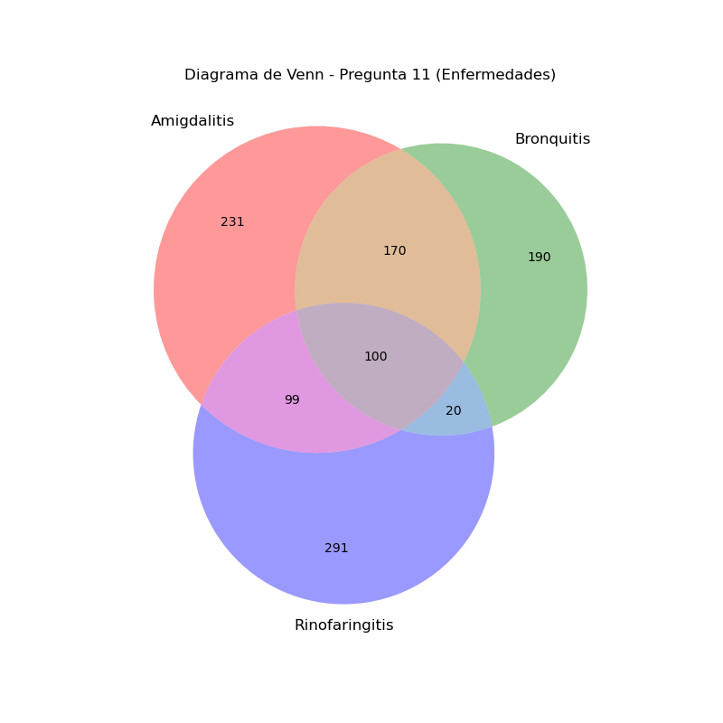
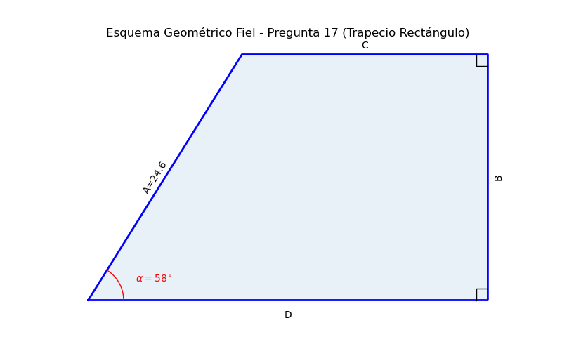
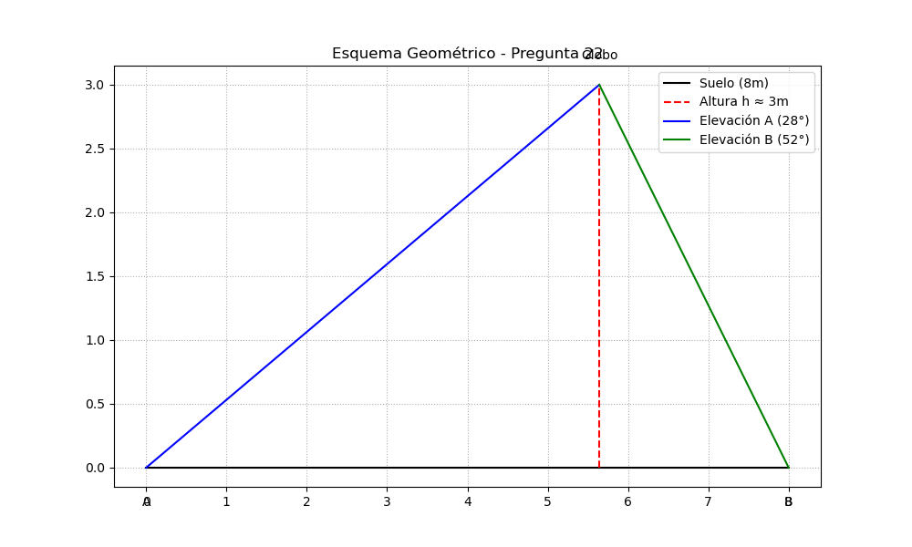

# Guía Pedagógica Definitiva: Taller de Repaso Control 3
**Materia:** Lógica, Conjuntos y Trigonometría  
**Docente:** Carol Asencio  
**Resolución:** Gemini Academic Assistant  

---

## Introducción Conceptual
Esta guía ha sido diseñada como un recurso de estudio exhaustivo. Cada ejercicio incluye una **Justificación Pedagógica** que explica el razonamiento subyacente, un **Desarrollo Formal** paso a paso en LaTeX (con formato corregido para visualización óptima) y **Apoyos Visuales** donde la complejidad del problema lo amerita.

---

## I. Lógica Proposicional

### Pregunta 1: Deducción de Valores de Verdad
> **Justificación:** La disyunción ($\vee$) es falsa solo si ambos términos lo son. Esto nos permite "romper" la expresión de afuera hacia adentro.

**Desarrollo:**
Se sabe que $(p \rightarrow \sim q) \vee (\sim r \rightarrow s) \equiv F$.
1. $(p \rightarrow \sim q) \equiv F \implies p = V, \sim q = F \implies \mathbf{p=V, q=V}$.
2. $(\sim r \rightarrow s) \equiv F \implies \sim r = V, s = F \implies \mathbf{r=F, s=F}$.

**Evaluación de i:** $[(\sim r \vee q) \wedge q] \leftrightarrow [(\sim q \vee r) \wedge s]$
- Izquierda: $[(F \vee V) \wedge V] = V$.
- Derecha: $[(F \vee F) \wedge F] = F$.
- Resultado: $V \leftrightarrow F \equiv \mathbf{F}$.

**Evaluación de ii:** $(p \rightarrow r) \rightarrow [(p \rightarrow q) \vee \sim s]$
- Antecedente: $V \rightarrow F \equiv F$.
- Consecuente: $(V \rightarrow V) \vee V \equiv V$.
- Resultado: $F \rightarrow V \equiv \mathbf{V}$.

**Respuesta:** F y V (**Alternativa C**).

---

### Pregunta 2: Identificación de Contradicciones
> **Justificación:** Una contradicción es una proposición que es falsa para cualquier combinación de valores de sus variables.

**Desarrollo:**
- **I.** $(p \wedge \sim q) \leftrightarrow (p \rightarrow q)$. Como $p \rightarrow q \equiv \sim(p \wedge \sim q)$, tenemos la forma $A \leftrightarrow \sim A$, lo cual siempre es **F**.
- **II.** $(p \wedge \sim q) \wedge (p \vee q)$. Si $p=V, q=F$, la expresión es $V \wedge V = V$. No es contradicción.
- **III.** $\sim (p \Delta q) \rightarrow q$. Si $q=V$, el consecuente es $V$, por ende la implicación es $V$. No es contradicción.

**Respuesta:** Solo I (**Alternativa B**).

---

### Pregunta 9: Valor de Verdad con Implicación
> **Justificación:** La implicación es falsa únicamente cuando de una verdad se concluye una falsedad ($V \rightarrow F$).

**Desarrollo:**
$p \implies (q \vee r) \equiv F \implies p=V$ y $(q \vee r)=F$.
De $(q \vee r)=F$, deducimos que $q=F$ y $r=F$.
- Evaluamos: $p \vee (q \wedge \sim r) \equiv V \vee (F \wedge V) \equiv V \vee F = \mathbf{V}$.

**Respuesta:** Es Verdadera (**Alternativa C**).

---

### Pregunta 10: Implicación Lógica con Conjunción
> **Justificación:** Una conjunción es verdadera solo cuando ambas partes son verdaderas.

**Desarrollo:**
$p \wedge \sim (q \vee r) \equiv V \implies p=V$ y $\sim (q \vee r)=V$.
De esto último, $q \vee r = F \implies q=F$ y $r=F$.
- Evaluamos: $p \implies (\sim q \wedge r) \equiv V \rightarrow (V \wedge F) \equiv V \rightarrow F = \mathbf{F}$.

**Respuesta:** Es Falsa (**Alternativa D**).

---

## II. Teoría de Conjuntos

### Pregunta 3: Operaciones con Intervalos Reales
> **Justificación:** Los conjuntos definidos por intervalos se resuelven visualizando la recta numérica. $C - B$ elimina de $C$ los elementos que están en $B$.

**Desarrollo:**
Sean $A = ]-2, 5]$, $B = ]-6, 3[$, $C = [1, 2]$.
1. Como el intervalo $[1, 2]$ está contenido completamente en $]-6, 3[$, al quitar $B$ de $C$, resulta vacío: $C - B = \emptyset$.
2. Realizamos la unión: $\emptyset \cup A = A = ]-2, 5]$.

**Respuesta:** $]-2, 5]$ (**Alternativa D**).

---

### Pregunta 4: Encuesta de Medicamentos
> **Justificación:** Utilizamos el diagrama de Venn y el principio de inclusión-exclusión. La clave es el dato de que 50 consumen al menos uno.

**Desarrollo:**
- $n(P \cup F \cup C) = 50$.
- Intersecciones exclusivas dadas: $FC \setminus P = 6$, $PC \setminus F = 3$.
- Intersección total $PF = 11$, que incluye a la triple intersección $x$. Por tanto, $PF \setminus C = 11 - x$.
- Suma de zonas de intersección: $6 + 3 + (11 - x) + x = 20$.
- Personas exclusivas de 1 producto: $50 - 20 = 30$.

**Respuesta:** 30 (**Alternativa A**).

---

### Pregunta 5: Porcentajes de Patologías (Diabetes)
> **Justificación:** Debemos descomponer los porcentajes para evitar contar doble. Partimos de las intersecciones triples hacia las dobles y luego a los conjuntos individuales.

**Desarrollo:**
Datos: $T=59\%, H=45\%, D=49\%$. Intersección triple $T \cap H \cap D = 5\%$.
1. Intersecciones dobles exclusivas:
   - $T \cap H \setminus D = 17\% - 5\% = 12\%$.
   - $H \cap D \setminus T = 18\% - 5\% = 13\%$.
2. Dado "Solo $T = 18\%$", hallamos la intersección doble faltante:
   - $T = \text{Solo } T + (T \cap H \setminus D) + (T \cap D \setminus H) + (T \cap H \cap D)$
   - $59\% = 18\% + 12\% + (T \cap D \setminus H) + 5\% \implies T \cap D \setminus H = 24\%$.
3. Regiones de "Solo":
   - Solo $H = 45\% - (12\% + 13\% + 5\%) = 15\%$.
   - Solo $D = 49\% - (24\% + 13\% + 5\%) = 7\%$.
4. Total de la unión (al menos una patología): $18+15+7+12+13+24+5 = 94\%$.
5. Patologías distintas a las tres (complemento): $100\% - 94\% = 6\%$.

**Respuesta:** 6% (**Alternativa C**).

---

### Preguntas 6, 7 y 8: Recetas Médicas (Antihistamínicos, Analgésicos, Antivirales)
> **Justificación:** Traducimos los datos a notación de conjuntos para hallar cada región de un diagrama de Venn de A, B y C.

**Desarrollo:**
- $A \cap B \setminus C = 20$.
- Solo $A = 40$.
- $A \setminus B = 55 \implies A \cap C \setminus B = 55 - 40 = 15$.
- Total $A = 100 \implies A \cap B \cap C = 100 - (40+20+15) = 25$.
- Solo $B = 50$.
- $B \cap C = 60 \implies B \cap C \setminus A = 60 - 25 = 35$.
- Total $C = 80 \implies \text{Solo } C = 80 - (15+35+25) = 5$.

**Resultados:**
6. $B \cap C \setminus A = 35$ (**Alternativa B**).
7. Antihistamínicos o antivirales, pero no analgésicos: $(A \cup C) \setminus B = \text{Solo } A + \text{Solo } C + (A \cap C \setminus B) = 40 + 5 + 15 = 60$ (**Alternativa D**).
8. Total encuestados (Unión): $40+50+5+20+15+35+25 = 190$ (**Alternativa A**).

---

### Pregunta 11: Casos de Salud en Concepción
> **Justificación:** Buscamos la región correspondiente a "Bronquitis y Amigdalitis, pero no Rinofaringitis", es decir, la intersección de $A$ y $B$ excluyendo la zona de $R$.

**Desarrollo:**
- Niños con $A$ y $B$: $n(A \cap B) = 270$.
- Niños con las tres ($A$, $B$ y $R$): $n(A \cap B \cap R) = 100$.
- Restamos la intersección triple a la intersección doble:
$n(A \cap B \setminus R) = 270 - 100 = 170$.

**Respuesta:** 170 niños (**Alternativa B**).

---

### Preguntas 12 y 13: Zonas de Diagramas de Venn
> **Justificación:** Observamos qué círculos incluyen el área sombreada y qué círculos la "recortan".

**Desarrollo P12:**
El área sombreada cubre la unión completa de $A$ y $B$, pero tiene un bocado exacto con la forma de $C$. Esto representa la unión menos el conjunto $C$.
**Respuesta 12:** $(A \cup B) - C$ (**Alternativa C**).

**Desarrollo P13:**
El área sombreada se encuentra únicamente donde se cruzan $A$ y $B$, pero excluye la porción inferior que pertenece a $C$.
**Respuesta 13:** $(A \cap B) - C$ (**Alternativa D**).

---

### Pregunta 14: Conjuntos con Valor Absoluto
> **Justificación:** Transformar la inecuación con valor absoluto a un intervalo estándar antes de realizar operaciones de conjuntos.

**Desarrollo:**
- $A = ]1, 2] \cup \{3\}$.
- Para $B$, resolvemos $|x-1| < 1 \implies -1 < x-1 < 1 \implies 0 < x < 2$. Entonces $B = ]0, 2[$.
- $C = [-2, 1[$.
1. Calculamos $B - C$: quitamos a $]0, 2[$ los valores entre $-2$ y casi $1$. Queda $[1, 2[$.
2. Unimos $(B - C) \cup A = [1, 2[ \cup (]1, 2] \cup \{3\}) = [1, 2] \cup \{3\}$.

**Respuesta:** $[1, 2] \cup \{3\}$ (**Alternativa B**).

---

## III. Trigonometría

### Pregunta 15: Simplificación de Expresiones
> **Justificación:** La estrategia maestra es convertir todas las funciones secundarias ($\sec, \tan$) a sus formas básicas de $\sin$ y $\cos$.

**Desarrollo:**
Sea $\theta = 4x$:
$$\frac{1 + \sec \theta}{\sin \theta + \tan \theta} = \frac{1 + \frac{1}{\cos \theta}}{\sin \theta + \frac{\sin \theta}{\cos \theta}} = \frac{\frac{\cos \theta + 1}{\cos \theta}}{\frac{\sin \theta \cos \theta + \sin \theta}{\cos \theta}}$$
Cancelamos los denominadores y factorizamos $\sin \theta$:
$$\frac{\cos \theta + 1}{\sin \theta(\cos \theta + 1)} = \frac{1}{\sin \theta} = \csc(4x)$$

**Respuesta:** $\csc(4x)$ (**Alternativa A**).

---

### Pregunta 16: Ecuación de Segundo Orden
> **Justificación:** Se trata como una ecuación cuadrática por factorización.

**Desarrollo:**
Resolver $2 \cos^2(x) - \cos(x) = 0$ en $[0, 2\pi]$.
Factorizamos por factor común $\cos(x)$:
$$\cos(x) (2\cos(x) - 1) = 0$$
- Caso 1: $\cos(x) = 0 \implies x = \frac{\pi}{2}, \frac{3\pi}{2}$.
- Caso 2: $2\cos(x) - 1 = 0 \implies \cos(x) = \frac{1}{2} \implies x = \frac{\pi}{3}, \frac{5\pi}{3}$.

**Respuesta:** $\{\frac{\pi}{3}, \frac{\pi}{2}, \frac{3\pi}{2}, \frac{5\pi}{3}\}$ (**Alternativa C**).

---

### Pregunta 17: Perímetro de Polígono
> **Justificación:** El perímetro es la suma de los contornos. Usamos senos y cosenos para hallar los catetos de los triángulos rectángulos que forman las "alas" del trapecio.

**Desarrollo:**
Lados dados: lado inclinado $A = 24.6$, ángulo $\alpha = 58^\circ$, altura $B = \text{base superior } C$.
1. Altura $B = A \cdot \sin(58^\circ) \approx 24.6 \cdot 0.8480 = 20.86$ cm.
2. Base superior $C = 20.86$ cm.
3. Base inferior $D = C + A \cdot \cos(58^\circ) = 20.86 + 24.6 \cdot 0.5299 \approx 20.86 + 13.04 = 33.90$ cm.
4. Perímetro: $24.6 + 20.86 + 20.86 + 33.90 = 100.22$ cm.

**Respuesta:** 100.22 cm (**Alternativa D**).

---

### Pregunta 18: Análisis de Existencia de Solución
> **Justificación:** Las funciones seno y coseno están limitadas al rango $[-1, 1]$. Toda ecuación que iguale estas funciones a un valor fuera del rango no tiene solución real.

**Desarrollo:**
- **I.** $2 \cos^2 \theta + 5 \cos \theta + 2 = 0 \implies (2\cos \theta + 1)(\cos \theta + 2) = 0$. $\cos \theta = -1/2$ sí tiene solución (la otra no, pero basta una).
- **II.** $\tan(\theta/4) = -\sqrt{3}$. La tangente tiene rango en todos los reales, así que siempre tiene solución.
- **III.** $2 \sin \theta - 1 = 3 \implies 2 \sin \theta = 4 \implies \sin \theta = 2$. Imposible, ya que $-1 \le \sin \theta \le 1$.

**Respuesta:** Solo la III (**Alternativa B**).

---

### Pregunta 19: Ecuaciones con Ángulo Doble
> **Justificación:** Homogenizamos los ángulos usando la identidad $\sin(2x) = 2 \sin x \cos x$.

**Desarrollo:**
$$\sin(2x) \cos x - 2 \sin^3 x = 0$$
$$(2 \sin x \cos x) \cos x - 2 \sin^3 x = 0$$
$$2 \sin x (\cos^2 x - \sin^2 x) = 0$$
Usamos $\cos(2x) = \cos^2 x - \sin^2 x$:
$$2 \sin x \cos(2x) = 0$$
- $\sin x = 0 \implies x \in \{0, \pi, 2\pi\}$.
- $\cos(2x) = 0 \implies 2x \in \{\frac{\pi}{2}, \frac{3\pi}{2}, \frac{5\pi}{2}, \frac{7\pi}{2}\} \implies x \in \{\frac{\pi}{4}, \frac{3\pi}{4}, \frac{5\pi}{4}, \frac{7\pi}{4}\}$.

**Respuesta:** Es la unión de ambos conjuntos (**Alternativa C**).

---

### Pregunta 20: Aplicación Teorema de Pitágoras
> **Justificación:** Un poste y su sombra forman un triángulo rectángulo con el suelo.

**Desarrollo:**
- Altura (cateto 1) = $4$ m.
- Sombra (cateto 2) = $3$ m.
- Distancia buscada (hipotenusa): $\sqrt{4^2 + 3^2} = \sqrt{16 + 9} = \sqrt{25} = 5$ m.

**Respuesta:** 5 metros (**Alternativa B**).

---

### Pregunta 21: Teorema del Coseno
> **Justificación:** Cuando conocemos dos lados y el ángulo comprendido, usamos la generalización de Pitágoras: el Teorema del Coseno.

**Desarrollo:**
$$c^2 = a^2 + b^2 - 2ab \cos(\theta)$$
$$c^2 = 450^2 + 550^2 - 2(450)(550) \cos(69^\circ)$$
$$c^2 = 202500 + 302500 - 495000 \cdot 0.358367$$
$$c^2 = 505000 - 177391.66 = 327608.34$$
$$c = \sqrt{327608.34} \approx 572 \text{ m}$$

**Respuesta:** 572 m (**Alternativa D**).

---

### Pregunta 22: Altura mediante Triangulación
> **Justificación:** Un problema de "dos estaciones" plantea un sistema de tangentes.

**Desarrollo:**
Sean $\alpha=28^\circ, \beta=52^\circ$ y la distancia total $d=8$ m. La proyección del globo divide la base $d$ en $x$ y $8-x$.
1. $\tan(28^\circ) = \frac{h}{x} \implies x = \frac{h}{\tan(28^\circ)}$
2. $\tan(52^\circ) = \frac{h}{8-x} \implies 8-x = \frac{h}{\tan(52^\circ)}$
Sumando $x + (8-x)$:
$$8 = h \left( \frac{1}{\tan 28^\circ} + \frac{1}{\tan 52^\circ} \right)$$
$$8 = h \cdot (1.8807 + 0.7813) \implies 8 = 2.662 \cdot h \implies h \approx 3 \text{ m}$$

**Respuesta:** 3 metros (**Alternativa C**).
