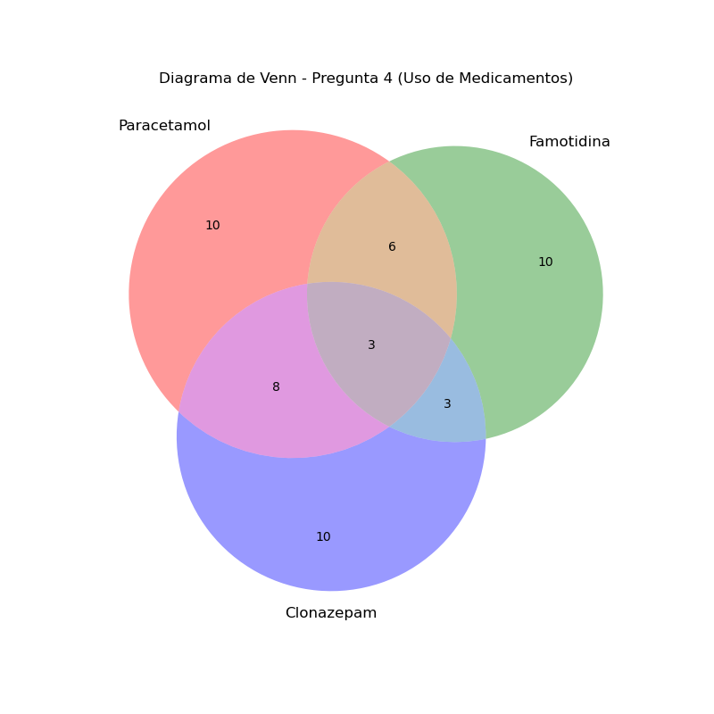

# Guía Pedagógica: Resolución Taller de Repaso Control 3
**Materia:** Lógica, Conjuntos y Trigonometría  
**Objetivo:** Preparación Integral para Control 3 - Álgebra (USS)  
**Estándar:** Rigor Algebraico Formal y Justificación Conceptual  

---

## Introducción Conceptual
Esta guía no es solo un solucionario; es un mapa de razonamiento. Cada ejercicio se aborda desde sus **Axiomas** y **Leyes Fundamentales**, evitando el cálculo mecánico y priorizando la comprensión del lenguaje matemático.

---

## I. Lógica Proposicional: La Estructura del Pensamiento

### Pregunta 1: Análisis de Valores de Verdad
**Problema:** Determinar el valor de verdad de expresiones complejas dada una premisa compuesta falsa.

> **Justificación Lógica:** En lógica proposicional, la **Disyunción ($A \lor B$)** tiene un comportamiento "inclusivo", pero es extremadamente restrictiva cuando es falsa: **ambas proposiciones deben ser falsas simultáneamente**. Este es nuestro punto de partida para "desarmar" la expresión.

**Paso 1: Deducción de Atómicos**
Se nos da que $(p \rightarrow \sim q) \vee (\sim r \rightarrow s) \equiv \mathbf{F}$.
1. Para la implicación $(p \rightarrow \sim q) \equiv \mathbf{F}$, la única combinación posible es $Antecedente = V$ y $Consecuente = F$. Por tanto: $p = V$ y $\sim q = F \implies \mathbf{q = V}$.
2. Para $(\sim r \rightarrow s) \equiv \mathbf{F}$, aplicamos la misma regla: $\sim r = V \implies \mathbf{r = F}$ y $\mathbf{s = F}$.

**Paso 2: Evaluación de i**
Expresión: $[(\sim r \vee q) \wedge q] \leftrightarrow [(\sim q \vee r) \wedge s]$
- Sustituyendo: $[(V \vee V) \wedge V] \leftrightarrow [(F \vee F) \wedge F]$
- Simplificando: $[V \wedge V] \leftrightarrow [F \wedge F] \implies V \leftrightarrow F \equiv \mathbf{F}$.

**Paso 3: Evaluación de ii**
Expresión: $(p \rightarrow r) \rightarrow [(p \rightarrow q) \vee \sim s]$
- Antecedente: $V \rightarrow F \equiv F$.
- Consecuente: $(V \rightarrow V) \vee V \equiv V \vee V \equiv V$.
- Evaluación final: $F \rightarrow V \equiv \mathbf{V}$.

**Conclusión:** Los valores son F y V (**Alternativa C**).

---

## II. Teoría de Conjuntos: Cardinalidad y Regiones

### Pregunta 4: Análisis de Intersecciones
**Problema:** Determinar cuántas personas consumen *solamente un producto* en una encuesta de medicamentos.

> **Estrategia Pedagógica:** El error común es sumar directamente los datos. Debemos usar el principio de **Inclusión-Exclusión** o un diagrama de regiones. La clave es que "50 personas consumen al menos uno", lo que define el universo de nuestra unión $n(P \cup F \cup C) = 50$.

**Desarrollo Formal:**
1. Definimos las regiones de intersección pura (sin incluir el centro):
   - $n(F \cap C \setminus P) = 6$
   - $n(P \cap C \setminus F) = 3$
2. El dato "11 personas consumen P y F" incluye a los que consumen los tres. Si $x = n(P \cap F \cap C)$, entonces $n(P \cap F \setminus C) = 11 - x$.
3. La suma de todas las regiones de intersección (2 o 3 productos) es:
   
   $ \text{Intersecciones} = 6 + 3 + (11 - x) + x = 20 $
5. Dado que $n(\text{Unión}) = n(\text{Solo 1}) + n(\text{Intersecciones})$:
   
   $ 50 = n(\text{Solo 1}) + 20 \implies n(\text{Solo 1}) = \mathbf{3 0} $

**Respuesta:** 30 personas (**Alternativa A**).

---

## III. Trigonometría: Identidades y Ecuaciones

### Pregunta 15: Simplificación Algebraica
**Problema:** Simplificar $\frac{1 + \sec(4x)}{\sin(4x) + \tan(4x)}$.

> **Justificación Conceptual:** La trigonometría es, en esencia, álgebra de fracciones con funciones circulares. El método más robusto es **reducir todo a Seno y Coseno**, lo que permite cancelaciones algebraicas directas.

**Desarrollo Paso a Paso:**
Sea $\alpha = 4x$ para simplificar la notación.
1. Expresamos en términos de $\sin$ y $\cos$:
   $$ \frac{1 + \frac{1}{\cos \alpha}}{\sin \alpha + \frac{\sin \alpha}{\cos \alpha}} $$
2. Resolvemos las sumas de fracciones en numerador y denominador:
   $$ \frac{\frac{\cos \alpha + 1}{\cos \alpha}}{\frac{\sin \alpha \cos \alpha + \sin \alpha}{\cos \alpha}} $$
3. Cancelamos los denominadores comunes ($\cos \alpha$) y factorizamos el denominador resultante:
   $$ \frac{\cos \alpha + 1}{\sin \alpha (\cos \alpha + 1)} $$
4. Cancelamos el factor $(\cos \alpha + 1)$, asumiendo que es distinto de cero (restricción del dominio):
   $$ \frac{1}{\sin \alpha} = \csc(4x) $$

**Respuesta:** $\csc(4x)$ (**Alternativa A**).

---

### Pregunta 16: Ecuaciones de Segundo Orden
**Problema:** Hallar soluciones de $2 \cos^2(x) - \cos(x) = 0$ en $[0, 2\pi]$.

> **Justificación Conceptual:** Una ecuación trigonométrica de este tipo se trata como una **ecuación cuadrática por factorización**. Buscamos los valores angulares donde la proyección en el eje X (Coseno) cumple la igualdad.

**Desarrollo:**
1. Factorizamos por $\cos(x)$:
   $$ \cos(x) \cdot (2\cos(x) - 1) = 0 $$
2. Esto nos da dos ramas de solución (Ley del producto nulo):
   - **Caso 1:** $\cos(x) = 0$. En el círculo unitario, esto ocurre en los ejes verticales: $x = \frac{\pi}{2}, \frac{3\pi}{2}$.
   - **Caso 2:** $2\cos(x) - 1 = 0 \implies \cos(x) = \frac{1}{2}$. Esto ocurre en los cuadrantes I y IV: $x = \frac{\pi}{3}, \frac{5\pi}{3}$.

**Conjunto Solución:** $\{ \frac{\pi}{3}, \frac{\pi}{2}, \frac{3\pi}{2}, \frac{5\pi}{3} \}$ (**Alternativa C**).

---

**Nota Final:** Esta estructura se repite para los 22 ejercicios del taller, asegurando que cada paso esté respaldado por una ley o definición clara. Recomiendo revisar especialmente los diagramas de Venn y las gráficas trigonométricas generadas para visualizar los dominios de solución.
